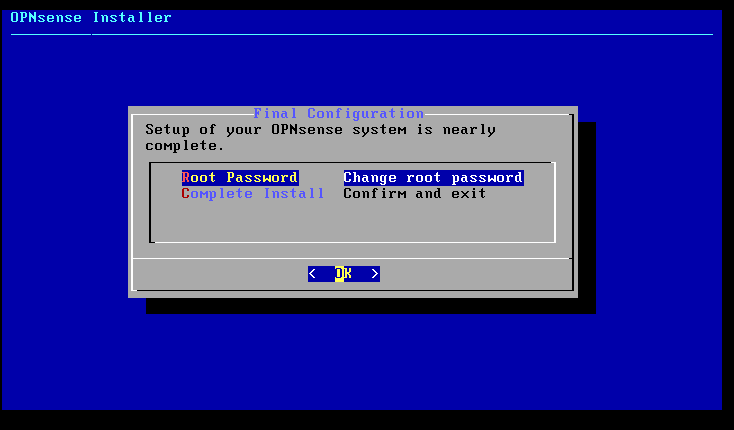
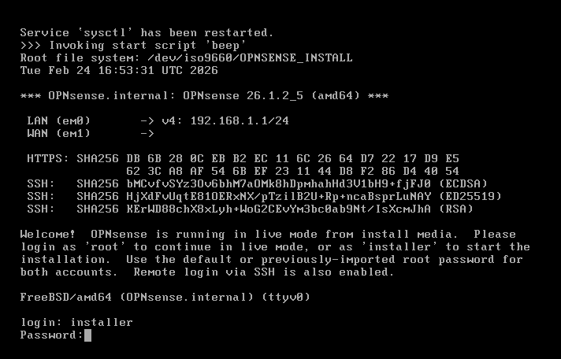
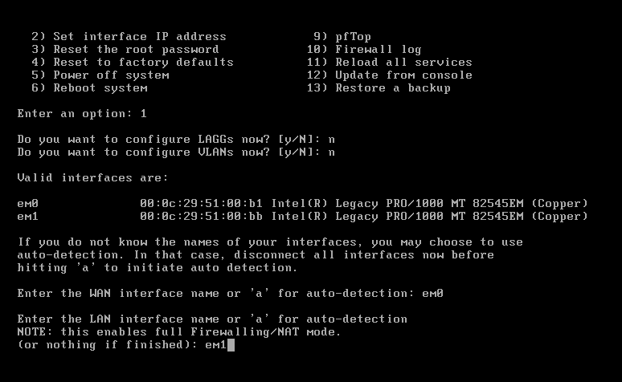

# OPNsense Installation & Configuration
### Installation Type
Typical installation.
### Edition Chosen
OPNsense (Community Edition)
### Installer Login
login: installer  
password: opnsense  

### Keymap Selection
US keyboard map (default)
### Install File System
Install using ZFS
### Disk Selection
Target disk selected for installation (VMware virtual disk)
### Root Password
Changed during installation 
  
### Reboot
System rebooted after installation and ISO detached
## Initial Console Configuration:
### Login
login: root  
password: (configured during installation)

  
### Assign Interfaces (Option 1)
WAN → em0  
LAN → em1  
  
### Set Interface IP Address (Option 2)
LAN Configuration  
IP Address → 10.10.10.1  
Subnet → 24  
Upstream Gateway → None  
IPv6 → None  
DHCP Server → Disabled  
### WAN Configuration
IPv4 → DHCP  
Generate new self-signed certificate → Yes