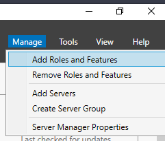
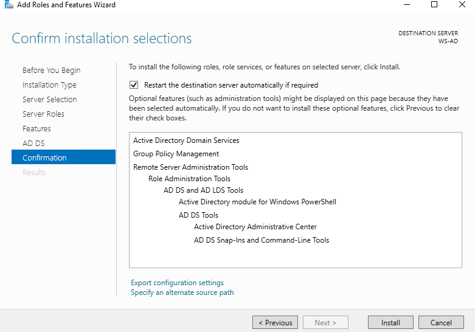

# Installation
### 1. Access Path  
Server Manager → Manage → Add Roles and Features  
  
### 2. Before You Begin  
Default settings (informational page).  
### 3. Installation Type  
Role-based or feature-based installation.  
### 4. Server Selection  
Select the local server from the server pool.  
### 5. Server Roles  
Active Directory Domain Services (AD DS) selected.  
Required features added automatically when prompted.  
### 6. Features  
Default features (no additional manual selection required).  
### 7. AD DS Confirmation  
Confirm installation of:  
    • Active Directory Domain Services  
    • Group Policy Management  
    • Remote Server Administration Tools  
### 8. Installation Confirmation  
Click Install.  
  
### After installation:  
    • AD DS role appears as installed.  
    • A notification flag (!) appears in Server Manager indicating that configuration is required.
  