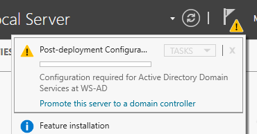
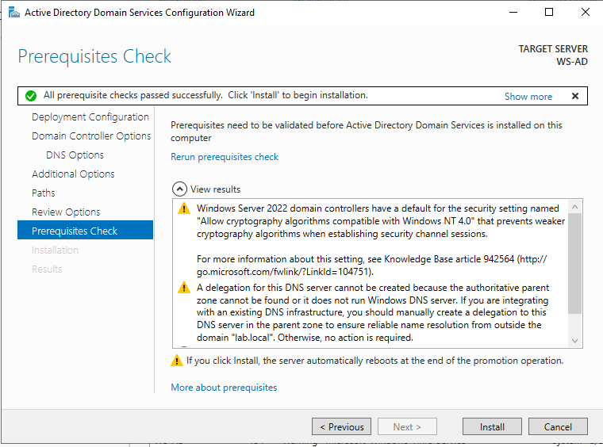

# Promotion to Domain Controller
### 1. Access
Click the notification flag → Promote this server to a domain controller.  
  
### 2. Deployment Configuration
       Option selected:  
        ◦ Add a new forest
       Root domain name: lab.local
### 3. Domain Controller Options
        ◦ Forest functional level: Windows Server 2016
        ◦ Domain functional level: Windows Server 2016
        ◦ DNS Server: Enabled
        ◦ Global Catalog (GC): Enabled
        ◦ Read-Only Domain Controller (RODC): Not selected
        ◦ Directory Services Restore Mode (DSRM) Password configured 
        ◦ DNS Options Create:DNS delegation: Not selected
### 4. Additional Options
       NetBIOS Domain Name automatically generated:
       LAB
### 5. Paths
       Default paths used for:
        ◦ AD DS database
        ◦ Log files
        ◦ SYSVOL
### 6. Review Options
        ◦ Configuration summary reviewed
        ◦ PowerShell script available via “View Script”
### 7. Prerequisites Check
                All prerequisite checks passed successfully.
  
### 8. Installation
        ◦ Click Install.
        The server completes configuration and restarts automatically.
