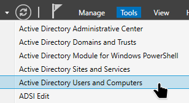

# OU Creation
## Structure:
lab.local  
│  
├─ EMPLOYEES  
│ ├─ Admin ← accounts with administrative rights (Client)  
│ └─ Standard ← standard user accounts (Client2)  
│  
└─ COMPUTERSS  
├─ Servers ← servers (Windows Server, Ubuntu Server)  
└─ Clients ← user PCs (Client, Client2)  

## Creation with GUI
### 1. Open Server Manager
        ◦ Tools → Active Directory Users and Computers  

  
### 2. Navigate to your domain: lab.local
### 3. Create the main OUs:
        ◦ Right-click on the domain → New → Organizational Unit →Name it → Click OK  
       Do not check “Protect container from accidental deletion” to allow deletion.  
### 🔹 How to Delete a Protected OU:
If you checked the “Protect container from accidental deletion” here’s how to delete it:  
### 1. Disable protection
        ◦ Right-click the OU → Properties → Object
        ◦ Uncheck Protect object from accidental deletion
        ◦ Click OK
### 2. Delete the OU
        ◦ Right-click the OU → Delete
        ◦ Confirm the deletion

## Creation with PowerShell
### 1. Open PowerShell ISE
        ◦ Start → PowerShell ISE →Script
### 2. Write the following code:
        New-ADOrganizationalUnit -Name: "EMPLOYEES" -Path: "DC=lab, DC=local" -ProtectedFromAccidentalDeletion:$false -Server:"WS-AD.lab.local"
        New-ADOrganizationalUnit -Name: "Admin" -Path: "OU=EMPLOYEES, DC=lab, DC=local" -ProtectedFromAccidentalDeletion:$false -Server:"WS-AD.lab.local"
        New-ADOrganizationalUnit -Name: "Standard" -Path: "OU= EMPLOYEES, DC=lab, DC=local" -ProtectedFromAccidentalDeletion:$false -Server:"WS-AD.lab.local"
#### 
        New-ADOrganizationalUnit -Name: "COMPUTERSS" -Path: "DC=lab, DC=local" -ProtectedFromAccidentalDeletion:$false -Server:"WS-AD.lab.local"
        New-ADOrganizationalUnit -Name: "Servers" -Path: "OU=COMPUTERSS, DC=lab, DC=local" -ProtectedFromAccidentalDeletion:$false -Server:"WS-AD.lab.local"
        New-ADOrganizationalUnit -Name: "Clients" -Path: "OU=COMPUTERSS, DC=lab, DC=local" -ProtectedFromAccidentalDeletion:$false -Server:"WS-AD.lab.local" 

### The script is available here:
[OU.ps1](../../scripts/powershell/03-Organizational-Units/OU.ps1)