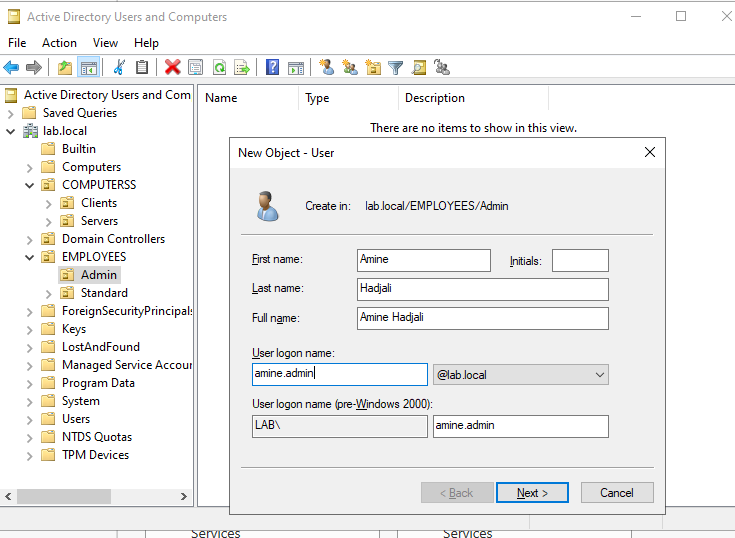

# User Creation
## Structure:
lab.local  
│  
├── EMPLOYEES  
│   ├── Admin  
│   │   └── amine.admin  
│   │  
│   └── Standard  
│       ├── amine.user  
│       └── client2.user  
│  
└── COMPUTERSS  
    ├── Servers  
    │   ├── WS  
    │   └── Ubuntu  
    │  
    └── Workstations  
        ├── Client  
        └── Client2  

## Creation with GUI
###    1. Open Active Directory Users and Computers (ADUC)
###        ◦ Start → Administrative Tools → Active Directory Users and Computers
### 2. Navigate to the OU where the user will be created
        ◦ Example: lab.local → EMPLOYEES → Admin
### 3. Right-click the OU → New → User
### 4. Fill in the required information:
        ◦ First name
        ◦ Last name
        ◦ User logon name
        Example:  
        First name:   	    Amine  
        Last name:          Hadjali  
        User logon name:	amine.admin 
   
### 5. Click Next
### 6. Set a password
### 7. Click Next → Finish
        ◦ The user account will now appear in the selected OU.

## Creation with PowerShell
### 1. Open PowerShell ISE
        ◦ Start → PowerShell ISE →Script
### 2. Write the following code:
        New-ADUser `
        -Name "Amine Hadjali" `
        -GivenName "Amine" `
        -Surname "Hadjali" `
        -SamAccountName "amine.admin" `
        -UserPrincipalName "amine.admin@lab.local" `
        -Path "OU=Admin,OU=EMPLOYEES,DC=lab,DC=local" `
        -AccountPassword (ConvertTo-SecureString "Password123!" -AsPlainText -Force) `
        -Enabled $true
#### 
        New-ADUser `
        -Name "Amine Hadjali" `
        -GivenName "Amine" `
        -Surname "Hadjali" `
        -SamAccountName "amine.user" `
        -UserPrincipalName "amine.user@lab.local" `
        -Path "OU=Standard,OU=EMPLOYEES,DC=lab,DC=local" `
        -AccountPassword (ConvertTo-SecureString "Password123!" -AsPlainText -Force) `
        -Enabled $true
#### 
        New-ADUser `
        -Name "Client2 User" `
        -GivenName "Client2" `
        -Surname "User" `
        -SamAccountName "client2.user" `
        -UserPrincipalName "client2.user@lab.local" `
        -Path "OU=Standard,OU=EMPLOYEES,DC=lab,DC=local" `
        -AccountPassword (ConvertTo-SecureString "Password123!" -AsPlainText -Force) `
        -Enabled $true

### The script is available here:
[USERS.ps1](../../scripts/powershell/04-Users-Creation-and-Domain-Join/USERS.ps1)