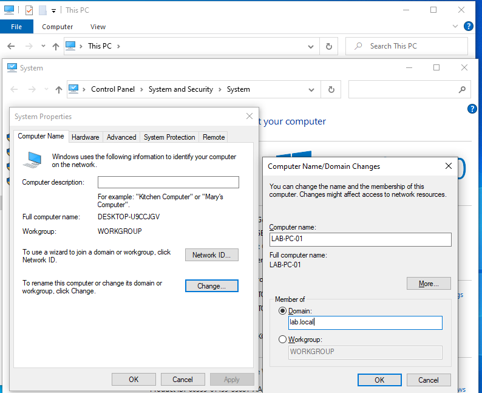

# Domain Join
This step allows a workstation to authenticate using the Active Directory domain instead of local accounts.
## Steps (Windows Client)
### 1. Open System Properties
    Right-click:  
    This PC → Properties  
    Then select:  
    Advanced system settings  
### 2. In the Computer Name tab click:
    Change
### 3. Change the Computer Name to:
    LAB-PC-01 

### 4. Select:
    Domain  
    Enter the domain name:  
    lab.local
### 4. Click OK
### 5. Enter domain administrator credentials
    LAB\Administrator
### 6. After authentication, a message appears:
    Welcome to the lab.local domain
### 7. Restart the computer.