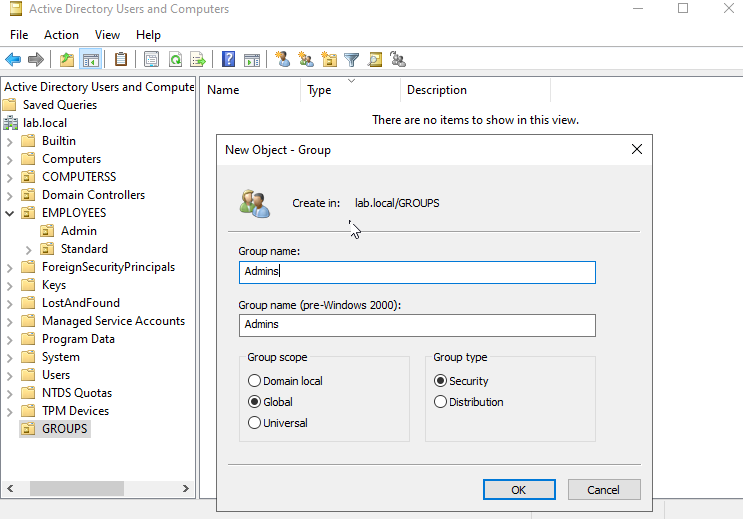

# Group Creation
## Structure:
lab.local  
├── EMPLOYEES  
├── COMPUTERSS  
└── GROUPS  
    ├── GG-Admins  
    │   └── amine.admin  
    └── GG-Users  
        ├── amine.user
        └── client2.user     
## Creation with GUI
### 1. Open Active Directory Users and Computers (ADU7C)
    Start → Administrative Tools → Active Directory Users and Computers
### 2. Create an OU ‘GROUPS’ (view 7)
### 3. Navigate to the OU where the group will be created
    lab.local → GROUPS 
### 4. Right-click the OU → New → Group
### 5. Configure the group:
    Setting	Example
    Group name	Admins
    Group scope	Global
    Group type	Security
 
### 6. Click OK
    The group will now appear inside the selected OU.
## Creation with PowerShell
### 1. Open PowerShell ISE
        ◦ Start → PowerShell ISE →Script
### 2. Write the following code:
New-ADGroup -Name "GG-Admins" -SamAccountName "GG-Admins" -GroupCategory Security -GroupScope Global -Path "OU=GROUPS,DC=lab,DC=local"

New-ADGroup -Name "GG-Users" -SamAccountName "GG-Users" -GroupCategory Security -GroupScope Global -Path "OU=GROUPS,DC=lab,DC=local" 

### The script is available here:
[GROUPS.ps1](../../scripts/powershell/05-Groups/GROUPS.ps1)