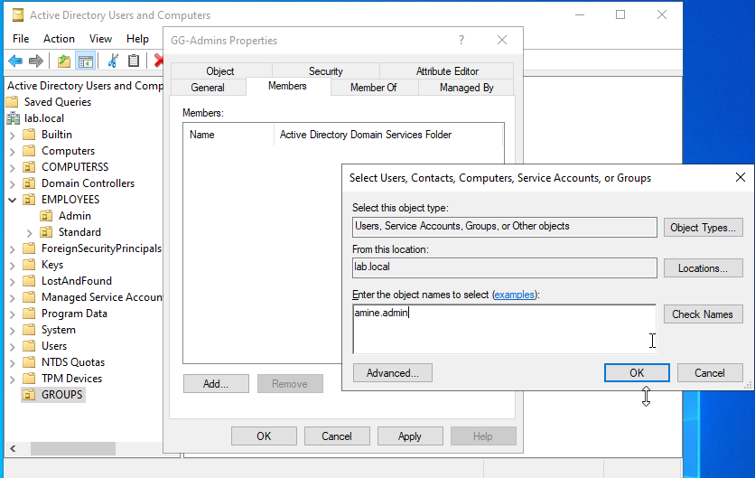

# Adding Users to a Group
## Adding with GUI
### 1. Open Active Directory Users and Computers
### 2. Locate the group
    Example:
    EMPLOYEES → Admins
### 3. Double-click the group
### 4. Open the Members tab
### 5. Click Add
### 6. Enter the user name
    Example:
    amine.admin
### 7. Click Check Names → OK

### 8. Click Apply → OK­
    The user is now a member of the group.
## Adding with PowerShell
### 1. Open PowerShell ISE
        ◦ Start → PowerShell ISE →Script
### 2. Write the following code:
Add-ADGroupMember -Identity "GG-Admins" -Members "amine.admin"

Add-ADGroupMember -Identity "GG-Users" -Members "amine.user", "client2.user"

### The script is available here:
[AddMembers.ps1](../../scripts/powershell/05-Groups/AddMembers.ps1)
