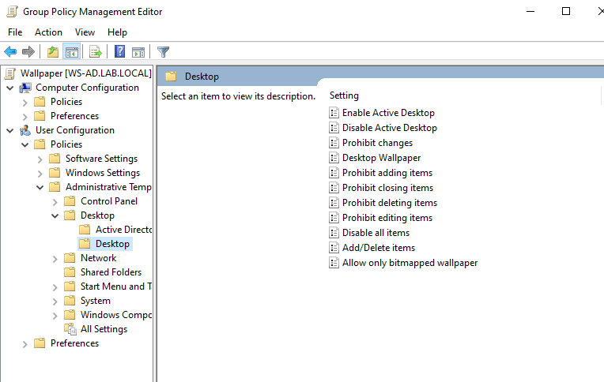

# Force Desktop Wallpaper for All Users
This GPO enforces a specific desktop wallpaper for all domain users.
## Steps:
### Prepare the Wallpaper Folder
#### 1. Create a folder on the server named:
    Wallpaper
#### 2. Enable sharing for the folder:
    • Right-click Wallpaper → Properties
    • Go to Sharing → Advanced Sharing
    • Check Share this folder
    • Click Permissions
    • Grant Full Control
    • Click Apply → OK
#### 3. Configure security permissions:
    • Go to Security tab
    • Click Edit → Add
    • Add the object:
        Domain Computers
    • Click OK → Apply → OK
#### 4. Copy the wallpaper image from the host machine into the folder and rename it:
    WP.jpg
### Open Group Policy Management
    On the Windows Server:
    Server Manager → Tools → Group Policy Management
#### Navigate to the domain:
    lab.local
#### Right-click the domain and select:
    Create a GPO in this domain, and Link it here
#### Name the GPO:
    Wallpaper
### Configure the GPO
#### 1. Right-click the newly created GPO → Edit
#### 2. Navigate to:
    User Configuration
    → Policies
        → Administrative Templates
            → Desktop
                → Desktop

#### 3. Configure the following policies:
    Disable Active Desktop
        • Double-click Disable Active Desktop
        • Select Enabled
        • Click Apply → OK
    Desktop Wallpaper
        • Double-click Desktop Wallpaper
        • Select Enabled
        • In Wallpaper Name, enter the full network path to the image:
    \\WS-AD\Wallpaper\WP.jpg
        • Click Apply → OK
#### 4. Return to the GPO list, right-click the Wallpaper GPO, and select:
    Enforced
### Apply the GPO on Client Machines
#### Ensure the GPO is linked to the appropriate OU containing the users (e.g., EMPLOYEES).
#### On client machines, run:
        gpupdate /force
#### Then:
        1. Log off the user session
        2. Log back in
#### The configured wallpaper should now be applied automatically.