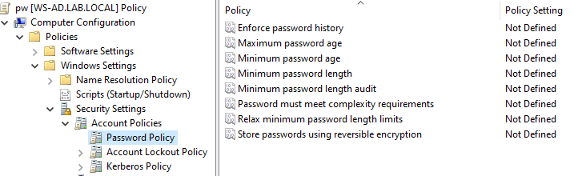

# Password Policy
This GPO enforces password policies for domain users, including:  
    • Minimum password length   
    • Password complexity requirements   
    • Password expiration   
    • Password history  
## Steps:
### Open Group Policy Management
#### On Windows Server :
    Server Manager → Tools → Group Policy Management
#### Navigate to:
    lab.local
### Edit the Default Domain Policy
#### On Active Directory, the Password Policy must be applied at the domain level.
#### 1. Navigate to :
    Forest → Domains → lab.local
#### 2. Right click on :
    Default Domain Policy
#### 3. Select :
    Edit
### Configure Password Policy
#### Navigate to :
    Computer Configuration
    → Policies
        → Windows Settings
            → Security Settings
                → Account Policies
                    → Password Policy

#### Configure for example :
#### Minimum password length
    8 characters
#### Password must meet complexity requirements
    Enabled
#### Maximum password age
    30 days
#### Enforce password history
    5 passwords remembered
### Apply the Policy
#### On client or on the server :
    gpupdate /force