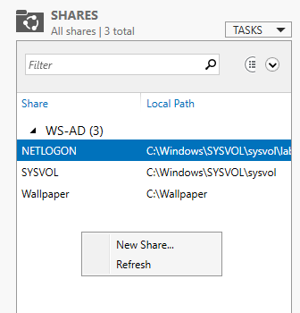
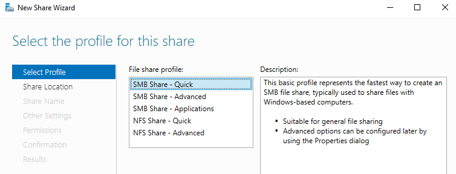
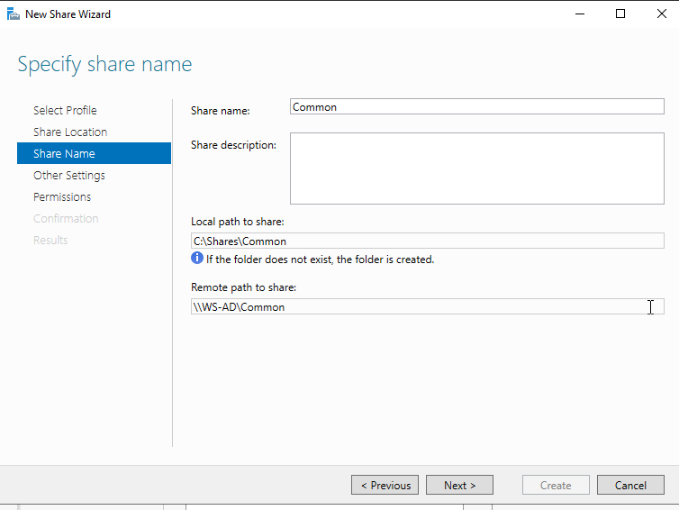
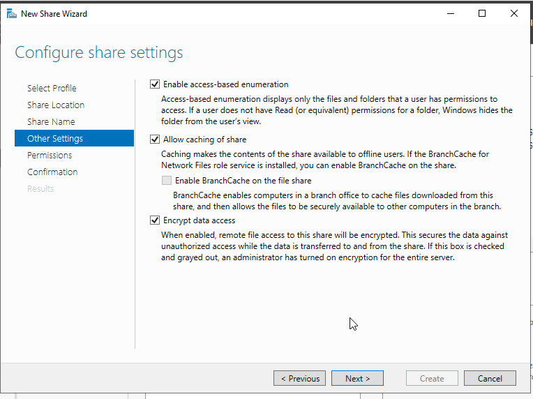
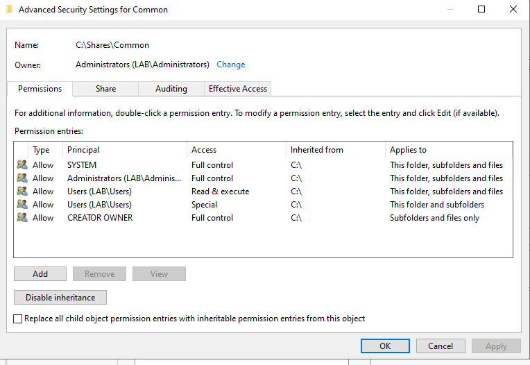
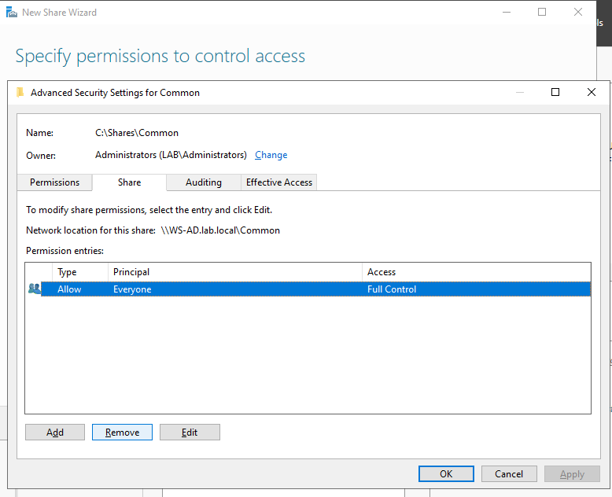

# Share creating
### Open Server Manager.
#### Navigate to:
    File and Storage Services
    → Shares
#### Right-click Shares and select:
    New Share

### Select Profile
#### Choose:
    SMB Share – Quick
Click Next.

### Share Location
#### Select:
    Select a volume: C:
Click Next.
### Share Name
#### Set the share name to:
    Common
#### This will create the local path:  
    C:\Shares\Common
#### and the network path:
    \\WS-AD\Common
Click Next.

### Other Settings
#### Enable the following options:
    • Enable access-based enumeration
    • Allow caching of share
    • Disable BranchCache on the file share
    • Encrypt data access
Click Next.

### Permissions
#### Select:
    Customize permissions
#### Remove default permissions
    Remove existing entries where applicable.  
    Existing inherited NTFS entries include:
        • Users (LAB\Users) – Read & Execute
        • Users (LAB\Users) – Special permissions
    Remove these entries.

#### Add custom permissions
    Add the following principals:
    GG-admins
        • Permission: Full Control
    GG-users
        • Permission: Modify
#### Share Permissions
    Remove the default:
        • Everyone – Full Control
    Then add:
    GG-admins
        • Permission: Full Control
    GG-users
        • Permission: Change (Read/Write access)

#### Apply settings
    Click:
        Apply → OK
### Confirmation
#### Review the configuration summary.
    Click:
        Create
#### Wait for the share to be created successfully.
    Click:
        Close