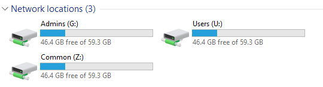
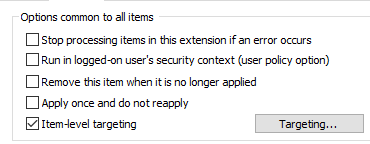
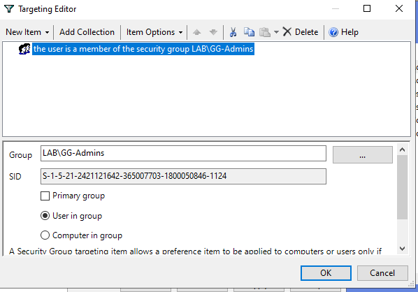

# Network Drive Mapping (GPO)
## Steps:
### Create the GPO
#### Open:
    Server Manager
        → Tools
        → Group Policy Management
#### Navigate to:
    lab.local
#### Right-click the domain and select:
    Create a GPO in this domain, and Link it here
#### Name the GPO:
    Network_Drive
### Configure Drive Mapping
#### Right-click the GPO and select:
    Edit
#### Navigate to:
    User Configuration
        → Preferences
            → Windows Settings
                → Drive Maps
#### Right-click:
    Drive Maps
        → New
        → Mapped Drive
#### Configure:
    Action: Update
    Location: \\WS-AD\Admins
    Reconnect: Enabled
    Label as: Admins
    Drive Letter: G:
#### Click:
    Apply → OK 
### Apply the GPO
#### On the client computer, run:
    gpupdate /force
#### Log off and log back on.
#### The network drive should appear as:
    G:Admins
#### We create these other drives with same method 
    U:Users
    Z:Common

## Configure Item-Level Targeting for Administrators Drive
#### Open the mapped drive properties:
    User Configuration
    → Preferences
    → Windows Settings
    → Drive Maps
    → A: (Administrators)
    → Properties
### Common Tab
    Select the Common tab.
#### Enable:
    Item-level targeting

#### Optionally enable:
    Remove this item when it is no longer applied
#### Click:
    Targeting...
### Configure Targeting

#### In the Targeting Editor, click:
    New Item
    → Security Group
#### Configure the following settings:
    Group: LAB\GG-Admins
    User in group: Enabled
#### Leave the following options disabled:
    Primary group
    Computer in group
#### Click:
    OK
### Apply the Configuration
#### Click:
    Apply
    → OK  
#### The drive mapping will now be applied only to users who are members of:
    LAB\GG-Admins
#### Users who are not members of the group will not receive the mapped drive.