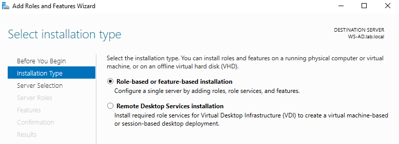
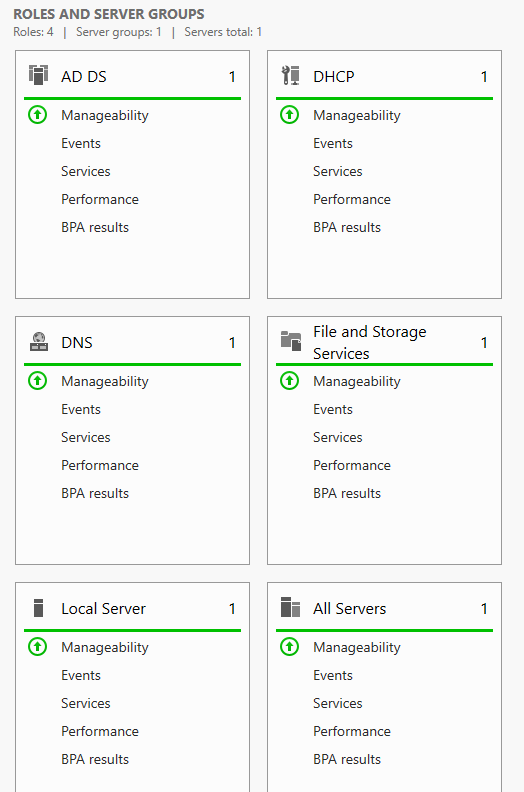

# DHCP Server Installation
### Install the DHCP Server Role
#### Open:
    Server Manager
    → Manage
    → Add Roles and Features
### Before You Begin
#### Review the information page and click:
    Next
### Installation Type

#### Select:
    Role-based or feature-based installation
#### Click:
    Next
### Server Selection
#### Select the target server:
    WS-AD
#### Click:
    Next
### Server Roles
#### Enable:
    DHCP Server
#### When prompted, click:
    Add Features
#### Click:
    Next
### Features
#### Keep the default settings and click:
    Next
### DHCP Server
#### Review the information page and click:
    Next
### Confirmation
#### Click:
    Install
#### Wait for the installation to complete.
### Complete DHCP Configuration
#### After the installation finishes, click the notification flag and select:
    Complete DHCP configuration
## DHCP Post-Install Configuration Wizard
### Description
#### Review the information page and click:
    Next
### Authorization
#### Select:
    Use the following user's credentials
#### User:
    LAB\Administrator
#### Click:
    Commit
#### Wait for the configuration to complete successfully.
#### Click:
    Close
### Verification in Active Directory
#### Open:
    Server Manager
    → Tools
    → Active Directory Users and Computers
#### Navigate to:
    lab.local
        → Users
#### The following groups should now be present:
    DHCP Administrators
    DHCP Users
#### These groups are automatically created during the DHCP Server authorization process.
