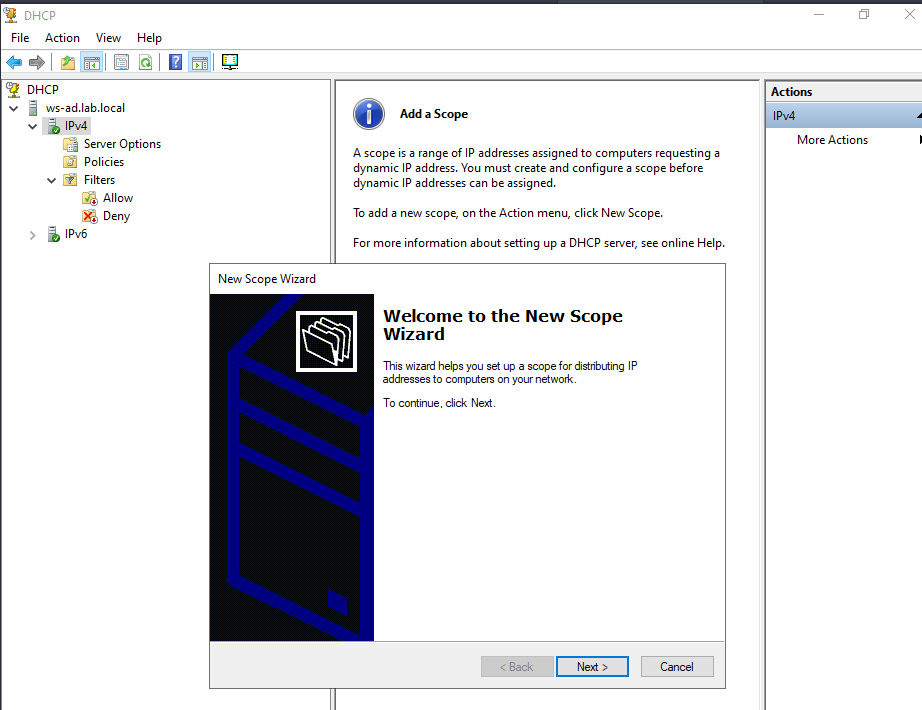
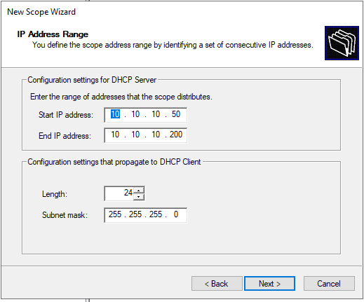

# DHCP Scope Configuration
### Create a New Scope
#### Open: (In the searching bar)
    Windows Administrative Tools
        → DHCP
        → IPv4
#### Right-click:
    IPv4
    → New Scope
#### Click:
    Next

### Scope Name
#### Enter:
    Name: IPv4_Scope
#### Click:
    Next
### IP Address Range
#### Configure the DHCP address pool:
    Start IP Address: 10.10.10.50
    End IP Address:   10.10.10.200
    Subnet Mask:
    255.255.255.0

#### Click:
    Next
### Add Exclusions and Delay
#### No exclusions were configured.
#### Click:
    Next
### Lease Duration
#### Leave the default value:
    8 Days
#### Click:
    Next
### Configure DHCP Options
#### Select:
    Yes, I want to configure these options now
#### Click:
    Next
### Router (Default Gateway)
#### Add:
    10.10.10.1
#### Click:
    Add
    → Next
### Domain Name and DNS Servers
#### Parent Domain:
    lab.local
#### DNS Server:
    10.10.10.20
#### Click:
    Add
    → Next
### WINS Servers
#### No WINS server was configured.
#### Click:
    Next
### Activate Scope
#### Select:
    Yes, I want to activate this scope now
#### Click:
    Next
    → Finish
### DHCP Scope Summary
#### The DHCP server is configured to distribute addresses in the following range:
    Network:        10.10.10.0/24
    Gateway:        10.10.10.1   (OPNsense)
    DNS Server:     10.10.10.20  (WS-AD)
    Domain Name:    lab.local
    DHCP Pool:
    10.10.10.50 → 10.10.10.200
#### Static addresses remain reserved for infrastructure devices such as the firewall and servers.