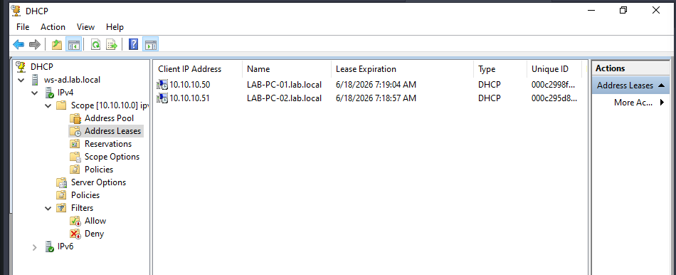

# DHCP Client Configuration and Verification
## Configure Clients to Use DHCP
Log in using an administrative account, as access to the Control Panel has been restricted for standard users.
#### Open:
    Control Panel
    → Network and Internet
    → Network and Sharing Center
#### Select:
    Ethernet
        → Properties
        → Internet Protocol Version 4 (TCP/IPv4)
        → Properties
#### Configure the following settings:
    Obtain an IP address automatically
    Obtain DNS server address automatically
#### Click:
    OK
    → Close
#### Repeat the same procedure on both client machines.
## DHCP Address Assignment
After the network adapter configuration is updated, the DHCP server automatically assigns IP addresses to the clients.
#### Example:
    Client 1 → 10.10.10.50
    Client 2 → 10.10.10.51
#### The assigned addresses may vary depending on the available addresses in the DHCP scope.
### Verify DHCP Leases
#### On the DHCP Server, open:
    DHCP
        → IPv4
        → IPv4_Scope
        → Address Leases
#### The client computers should appear in the list of active leases along with their assigned IP addresses.
#### This confirms that the DHCP server is successfully distributing IP configuration information to domain clients.
