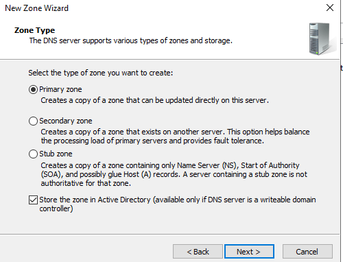

# DNS Resolution Before Configuration
#### Before configuring the Reverse Lookup Zone, DNS resolution behaves as follows:
    C:\Users\amine.admin>nslookup WS-AD
    Server:  UnKnown
    Address:  10.10.10.20

    Name:    WS-AD.lab.local
    Address:  10.10.10.20
#### Forward resolution works correctly, meaning the hostname WS-AD can be resolved to its IP address.
#### However, reverse resolution fails:
    C:\Users\amine.admin>nslookup 10.10.10.20
    Server:  UnKnown
    Address:  10.10.10.20

    *** UnKnown can't find 10.10.10.20: Non-existent domain
#### This indicates that no Reverse Lookup Zone (PTR records) exists for the network.

# Creating a Reverse Lookup Zone
#### Open:
    Server Manager
    → Tools
    → DNS
#### Navigate to:
    WS-AD
    → Reverse Lookup Zones
#### Start the creation of a new zone:
    • Zone Type: Primary Zone
    • Replication Scope: To all DNS servers running on domain controllers in the domain (lab.local)
    • Network ID: 10.10.10
    • Dynamic Updates: Allow only secure dynamic updates

#### Click Finish to create the zone.