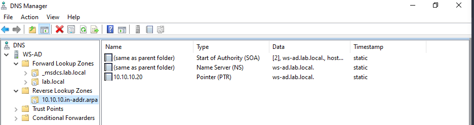

# Creating a PTR Record
#### Inside the newly created Reverse Lookup Zone:
    Reverse Lookup Zones → 10.10.10.x
#### Create a new Pointer (PTR) record:
    • IP Address: 10.10.10.20
    • Hostname: WS-AD.lab.local
    • Enable: Allow any authenticated user to update all DNS records with the same name
#### Click OK to validate.
