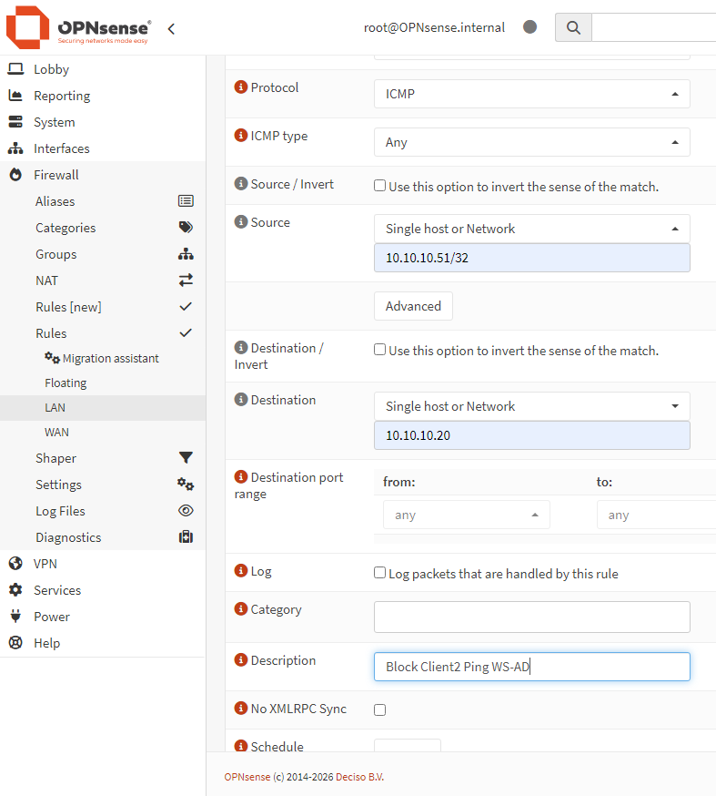

# Firewall Rule Testing
### Accessing the OPNsense Web Interface
#### From a client computer, open a web browser and access the OPNsense web interface:
    https://10.10.10.1
#### Log in using the administrator credentials.
### Creating a Firewall Rule
#### Navigate to:
    Firewall
    → Rules
    → LAN
#### Click:
    Add
#### Configure the rule:
    Setting:	        Value:
    Action	            Block
    Interface	        LAN
    Protocol	        ICMP
    Source	            10.10.10.51
    Destination	        10.10.10.1
    Description	        Block Client2 Ping Firewall
Save the rule.
#### Click:
    Apply Changes
to activate the new configuration.
### Testing Connectivity
#### From Client2:
    ping 10.10.10.1
#### Expected result:
    Request timed out.
The ICMP traffic is successfully blocked by the firewall rule.
### Firewall Logs
#### Navigate to:
    Firewall
    → Log Files
    → Live View
The blocked packets can be observed in real time.
#### Typical information displayed:  
    • Source IP address
    • Destination IP address
    • Protocol
    • Action (Pass or Block)
# Firewall Limitation in a Single Subnet Environment
A firewall rule was created to block communication between Client2 and the Windows Server.
#### Example rule:
    Setting	            Value
    Action	            Block
    Interface	        LAN
    Protocol	        Any
    Source	            10.10.10.51
    Destination	        10.10.10.20
The expected result was to prevent Client2 from communicating with the domain controller.

### Observed Behavior
#### The firewall rule successfully blocked communication between Client2 and the OPNsense firewall:
    Client2 → 10.10.10.1
#### However, the following communications still worked:
    Client2 → WS-AD
    Client2 → Client1
Ping requests and other traffic between the hosts remained functional.
### Explanation
#### All machines in the lab are currently located in the same network:
    10.10.10.0/24
#### Network layout:
    WS-AD        10.10.10.20
    Client1      10.10.10.50
    Client2      10.10.10.51
    OPNsense     10.10.10.1
When Client2 communicates with WS-AD, both hosts belong to the same subnet.  
The client performs an ARP request to discover the MAC address of the destination host and communicates directly through the virtual switch.  
#### The traffic path becomes:
    Client2
       ↓
    Virtual Switch
       ↓
    WS-AD
The packets never pass through OPNsense.    
### Why the Firewall Cannot Block the Traffic
A firewall can only filter traffic that traverses the firewall itself.
Since both hosts belong to the same network, the communication remains local to the switch and bypasses OPNsense completely.
As a result, firewall rules on the LAN interface do not affect communications between devices located in the same subnet.
### Traffic That Does Pass Through the Firewall
#### Traffic destined for another network is sent to the default gateway:
    Client2
       ↓
    OPNsense (10.10.10.1)
       ↓
    Internet
In this situation, OPNsense can inspect and filter the traffic.
### Conclusion
This experiment demonstrates an important networking principle:
A firewall cannot filter traffic between hosts located in the same Layer 2 network.
