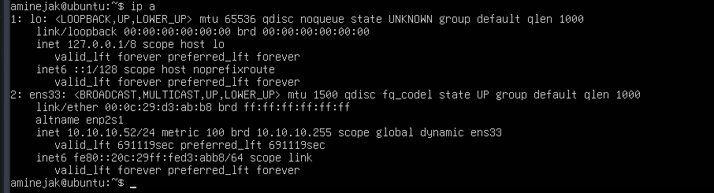
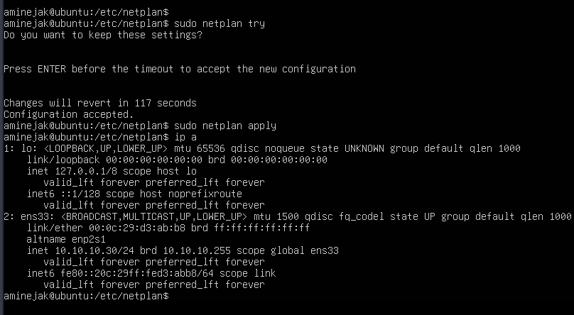

# Ubuntu Server Static IP Configuration:
The Ubuntu server initially received its IP address dynamically from the Windows DHCP server.

To ensure that the monitoring server always keeps the same address, a static IP configuration was implemented.

#### Access the Netplan file:
    cd /etc/netplan
    ls #we get 50-clouds.yaml
    sudo nano 50-clouds.yaml 
    #install nano with sudo apt install nano
#### The Netplan configuration file was modified:
    network:
    version: 2
    ethernets:
        ens33:
        dhcp4: false
        addresses:
            - 10.10.10.30/24
        routes:
            - to: default
            via: 10.10.10.1
        nameservers:
            addresses:
            - 10.10.10.20
#### The configuration was tested:
    sudo netplan try
#### After successful validation, the configuration was applied:
    sudo netplan apply
#### The new network configuration was verified:
    ip a
    ip route

#### Connectivity tests were performed: (install the command ping with sudo apt install iputils-ping)
    ping 10.10.10.1
    ping 10.10.10.20
    ping google.com
#### The Ubuntu server now uses the following static configuration:
    Setting	                Value
    IP Address	            10.10.10.30
    Subnet Mask	            255.255.255.0
    Default Gateway	        10.10.10.1
    DNS Server	            10.10.10.20
This configuration ensures that the future Zabbix server always remains reachable at the same IP address.