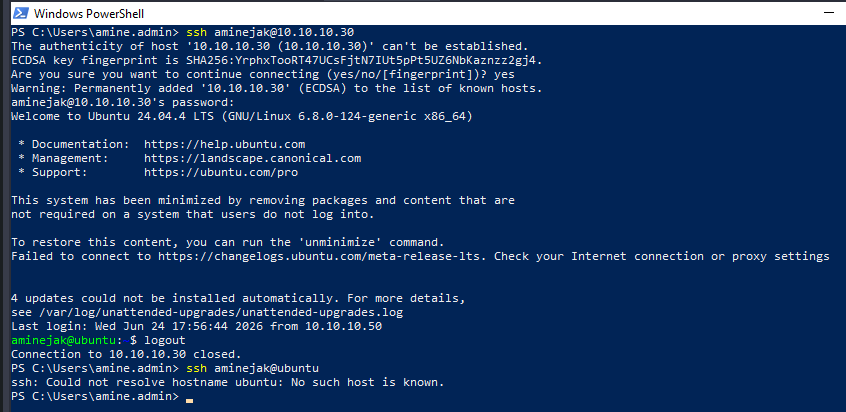

# Configuring OpenSSH on Ubuntu
#### The OpenSSH server was installed on Ubuntu Server.
    sudo apt install openssh-server -y
#### The SSH service was enabled and started:
    sudo systemctl enable ssh
    sudo systemctl start ssh
#### The service status can be verified using:
    sudo systemctl status ssh
## Testing SSH Connectivity
The Ubuntu server was accessed remotely from the Windows administrative workstation.
#### PowerShell command:
    ssh aminejak@10.10.10.30
This allows Linux administration without using the VMware console.

As shown above, the connection attempt using the command ssh aminejak@ubuntu fails because the hostname ubuntu cannot be resolved.

Unlike domain-joined Windows computers, the standalone Ubuntu server did not automatically register its hostname in the Active Directory DNS zone. Therefore, no DNS record existed for the server.

To allow hostname resolution, a manual DNS host (A) record must be created in the DNS server.