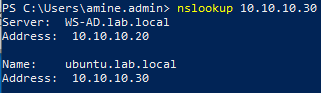
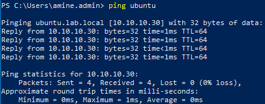

# Creating a DNS Host (A) Record
#### Navigation (from windows 10):
    DNS 
    → Forward Lookup Zones
    → lab.local
    → Right-click
    → New Host (A or AAAA)
#### Configuration:
    Setting	            Value
    Name	            ubuntu
    IP Address	        10.10.10.30
#### The option:
    Create associated PTR record
was enabled.
## DNS Verification
### nslookup

## ping

## SSH Using the Hostname
#### The Ubuntu server can now be accessed using its DNS name:
    ssh aminejak@ubuntu
#### instead of:
    ssh aminejak@10.10.10.30
This approach improves readability and reflects common administration practices in enterprise environments.

