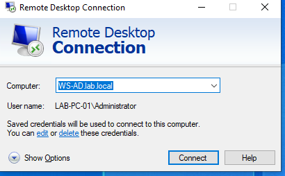
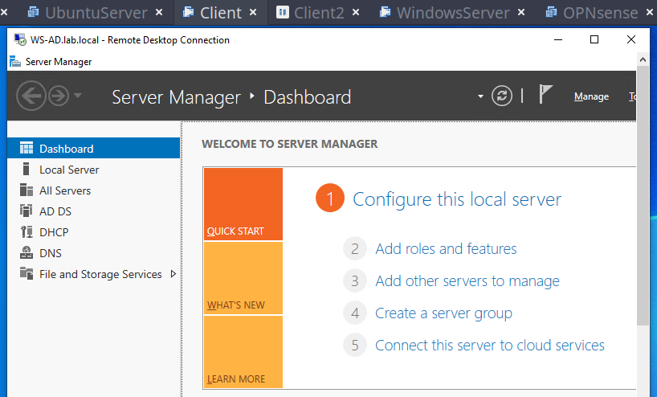

# Remote Desktop Protocol (RDP)
Remote Desktop Protocol (RDP) was enabled to allow remote administration of the Windows Server (it was enabled also in the windows workstation LAB-PC-02) from the administrative workstation. This approach reflects common enterprise practices and reduces the need to use the VMware console.
#### Navigation on the server:
    Settings
    → System
    → Remote Desktop
    → Enable Remote Desktop
#### From the administrative workstation:
    Start
    → Run
    → mstsc
#### In the Computer field, enter:
    WS-AD
#### or
    10.10.10.20

#### Authenticate using a domain administrative account:
    LAB\Administrator

RDP provides full graphical access to the server and allows administrators to perform management tasks remotely without directly accessing the virtual machine console.