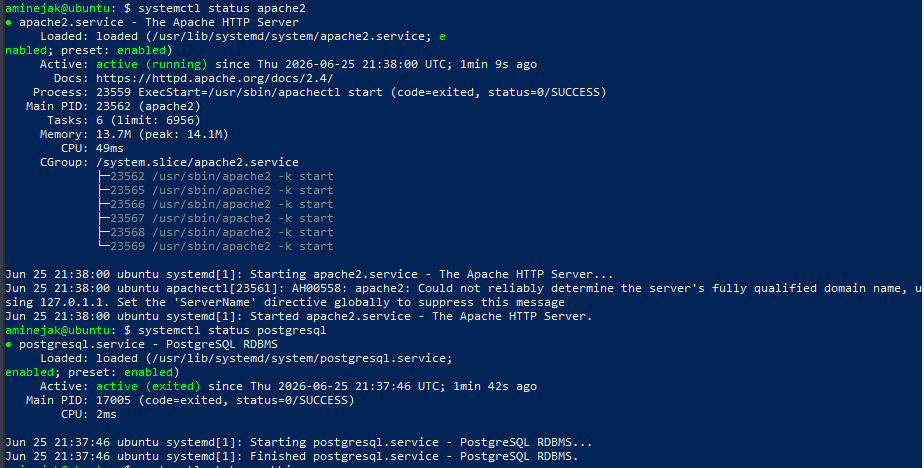
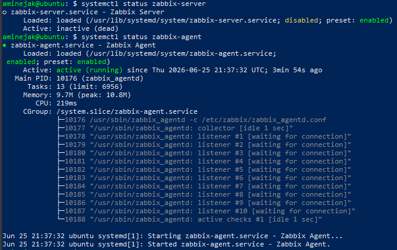

# Zabbix Installation 
#### We will install :
    Zabbix Server
    PostgreSQL
    Apache
    PHP Frontend
    Zabbix Agent
### Architecture :
    Ubuntu Server (10.10.10.30)
        ↓
    Zabbix Server
        ↓
    Monitor:
      WS-AD
      Windows 10
      Windows 10 Client2
      OPNsense
### Steps:
#### Update the system
    sudo apt update
    sudo apt upgrade -y
#### Download the Zabbix repository
    sudo wget https://repo.zabbix.com/zabbix/7.0/ubuntu/pool/main/z/zabbix-release/zabbix-release_7.0-2+ubuntu24.04_all.deb
#### Install it:
    sudo dpkg -i zabbix-release_latest_7.0+ubuntu24.04_all.deb
#### Update package information:
    sudo apt update
#### Install Zabbix components
    sudo apt install zabbix-server-pgsql zabbix-frontend-php zabbix-apache-conf zabbix-sql-scripts zabbix-agent postgresql -y
#### Verify services
    systemctl status mariadb
    systemctl status postgresql

    systemctl status zabbix-server
    systemctl status zabbix-agent
    

