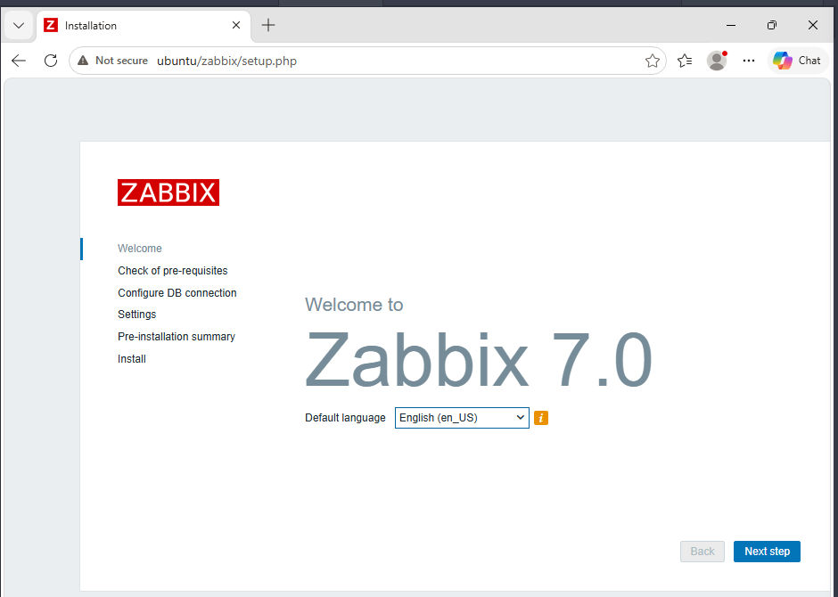
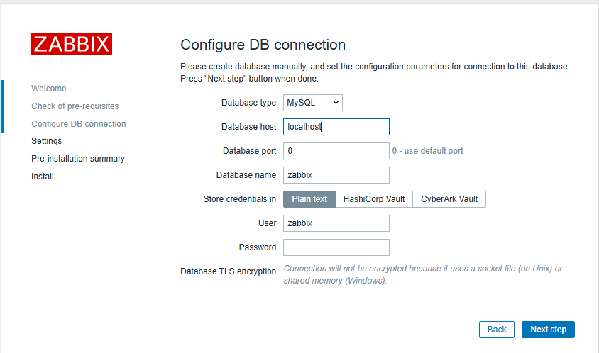

# Zabbix Web Interface Installation
After starting the Zabbix server and the Apache web server, the Zabbix web interface was accessed from the administrative workstation using a web browser.
#### The following URL was used:
    http://10.10.10.30/zabbix
#### or
    http://ubuntu/zabbix
### Welcome Page
#### The Zabbix installation wizard was launched automatically and presented the following installation steps:
    • Welcome
    • Check of pre-requisites
    • Configure DB connection
    • Settings
    • Pre-installation summary
    • Install

### Check of Pre-requisites
#### The installer verified the system requirements, including:
    • PHP version
    • Memory limits
    • Maximum execution time
    • PHP extensions
    • Database support
    • LDAP support
    • OpenSSL support
#### Initially, the following error was displayed:
    System locale: C
    Required: en_US
    Status: Fail
#### The system locale was configured by generating and applying the English UTF-8 locale:
    sudo locale-gen en_US.UTF-8
    sudo update-locale LANG=en_US.UTF-8
After restarting Apache, the pre-requisite check completed successfully.
### PostgreSQL Support for PHP
The database selection page initially displayed only MySQL because the PHP PostgreSQL module was not installed.
#### The required package was installed:
    sudo apt install php-pgsql -y
#### The Apache service was then restarted:
    sudo systemctl restart apache2
After refreshing the installation page, PostgreSQL became available as a supported database type.
### Database Connection Configuration
#### The following parameters were configured:
    Parameter	            Value
    Database type	        PostgreSQL
    Database host	        localhost
    Database port	        5432
    Database name	        zabbix
    User	                zabbix
    Password	            ********
    Database schema	        public
    Store credentials in	Plain text
    TLS encryption	        Disabled
TLS encryption was not enabled because the database server and the Zabbix server were running on the same machine and communicated through a local connection.

### Zabbix Settings
#### The following settings were configured:
    Setting	                Value
    Zabbix server name	    Zabbix Lab
    Default time zone	    Africa/Algiers
    Default theme	        Blue
The Africa/Algiers time zone was selected to ensure correct timestamps for events, graphs, and monitoring data.
### Installation Completion
#### The installer generated the Zabbix frontend configuration file:
    /etc/zabbix/web/zabbix.conf.php
After completing the installation, the Zabbix login page became available.
#### Default credentials:
    Username: Admin
    Password: zabbix
The Zabbix frontend was successfully connected to the PostgreSQL database and was ready for monitoring configuration.