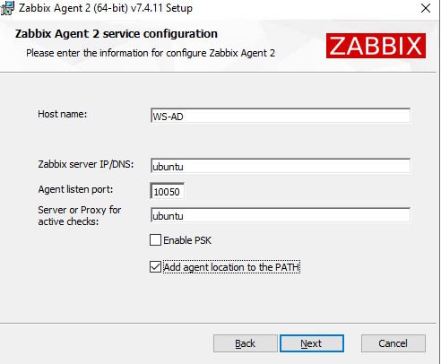
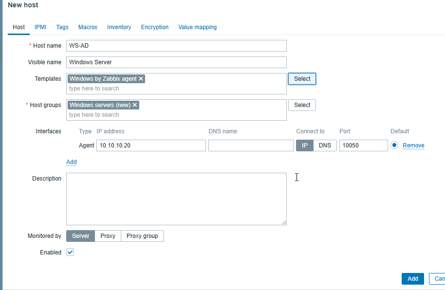
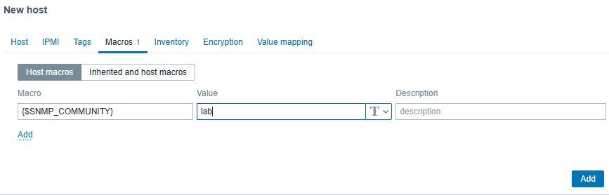
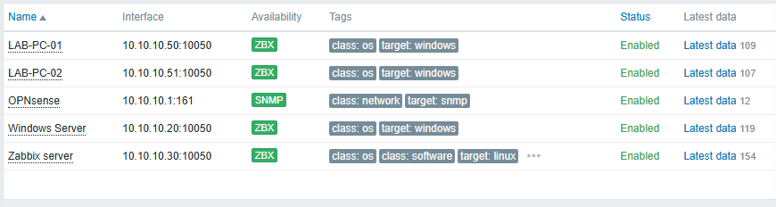

# Creating and Monitoring Hosts
## Ubuntu Server (Zabbix Server)
During the installation of Zabbix Server, a default host named Zabbix server was created automatically. This host represents the Ubuntu server hosting both the Zabbix Server and Zabbix Agent services.
#### The host was already linked to the appropriate Linux template and required no manual creation. The following checks were performed:
    • Verified that the Zabbix Server and Zabbix Agent services were running.
    • Confirmed that the agent configuration matched the default host name (Hostname=Zabbix server).
    • Verified that the ZBX availability indicator was green.
## Windows Hosts (WS-AD, LAB-PC-01 and LAB-PC-02)
The same procedure was followed for the Windows Server and both Windows 10 workstations. The Windows Server (WS-AD) and the workstation LAB-PC-02 were administered remotely using Remote Desktop Protocol (RDP).
#### The Zabbix Agent was installed on each machine using the following configuration:
    • Zabbix server IP/DNS: ubuntu
    • Server or proxy for active checks: ubuntu
    • Hostname: Machine name (WS-AD, LAB-PC-01 or LAB-PC-02)
    • Add agent location to the PATH: Enabled
    • Enable PSK: Disabled

### Creating Hosts
The Windows machines were added manually to Zabbix from Data Collection → Hosts → Create host.
#### For each host, the following parameters were configured:
    • Host name: Same value as the Hostname parameter configured in the Zabbix Agent.
    • Host group: Appropriate group according to the machine role(Windows servers for WS-AD and Workstations for LAB-PC-01 and LAB-PC-02).
    • Agent interface: IP address of the monitored machine (port 10050).
    • Template: Windows by Zabbix agent.

#### Note: The value of the Hostname parameter in zabbix_agentd.conf must match the Host name configured in Zabbix exactly. Otherwise, active checks will fail.
## OPNsense Host
Unlike the Windows and Linux hosts, OPNsense was monitored using the Simple Network Management Protocol (SNMP) instead of the Zabbix Agent.  
The built-in bsnmpd service available on OPNsense was configured to expose monitoring information to the Zabbix server.
#### The following configuration changes were applied:
    • The Host Resources module was enabled to provide system information.
    • The PF module was enabled to expose firewall-related data.
    • A custom SNMP community named lab was configured.
    • The bsnmpd service was enabled and started.
    • UDP port 161 was allowed through the firewall to permit SNMP requests from the monitoring server.
#### The SNMP configuration was verified from the Ubuntu server using the following command:
    snmpwalk -v2c -c lab 10.10.10.1 1.3.6.1.2.1.1
The command successfully returned the system description, uptime, hostname, location, and other management information, confirming that SNMP communication between Zabbix and OPNsense was functioning correctly.  
After validating the SNMP service, a new host named OPNsense was created in Zabbix.
#### The host was configured with the following parameters:
    Parameter	            Value
    Host name	            OPNsense
    Host group	            Network Devices
    Interface type	        SNMP
    IP address	            10.10.10.1
    Port	                161
    SNMP version	        SNMPv2
    Community	            lab
#### An SNMP macro was then configured for the host:
    Macro	                Value
    {$SNMP_COMMUNITY}	    lab

The Generic SNMP template was then linked to the host, allowing Zabbix to automatically collect standard SNMP metrics without requiring a Zabbix Agent.  
Once the configuration was completed, the SNMP availability indicator turned green, confirming successful communication between the Zabbix server and the firewall.  
This demonstrated a second monitoring approach within the laboratory environment, where servers and workstations were monitored using the Zabbix Agent, while the network firewall was monitored through SNMP.
## Verification
#### Communication between the Zabbix Server and each monitored host was verified by:
    • Confirming that the Zabbix Agent service was running.
    • Checking that the ZBX and SNMP availability indicators turned green.
    • Verifying that monitoring data (CPU usage, memory, disk usage, network activity, operating system information, etc.) appeared in Latest Data.

