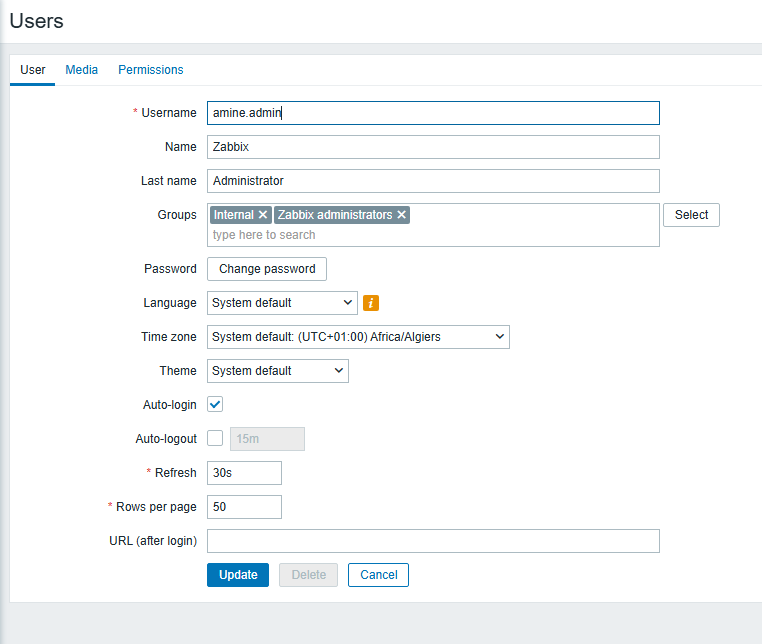
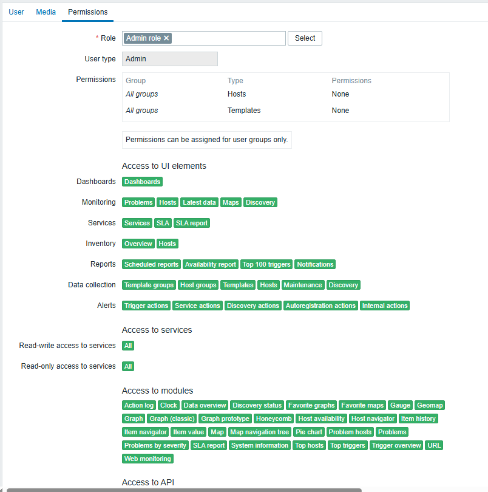
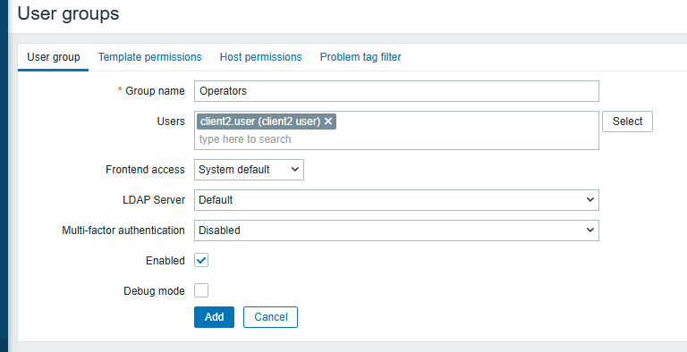
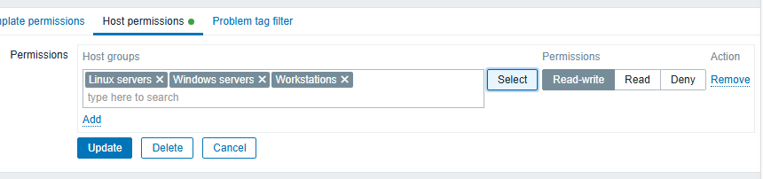
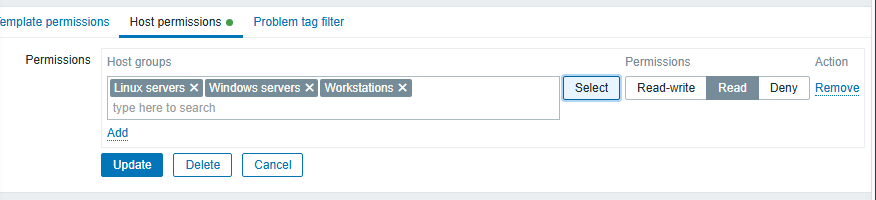

# User Management
## Creating Users & Assigning Roles
To simulate a small enterprise environment, three user accounts were configured with different privilege levels.
### Super Administrator
The default Admin account created during the Zabbix installation was renamed to amine.admin instead of creating a new Super Administrator account.
#### Configuration:
    • Username: amine.admin
    • Role: Super admin
    • User group: Zabbix administrators

### Administrator
A second administrative account was created to represent a junior administrator responsible for the day-to-day management of the monitoring platform.
#### Configuration:
    • Username: amine.user
    • Role: Admin
    • User group: Zabbix administrators

### Standard User
A standard user account was created to simulate a support technician with limited privileges.
#### Configuration:
    • Username: client2.user
    • Role: User
    • User group: Operators

## Creating User Groups
The default Zabbix administrators user group provided by Zabbix unchanged and reserved for the local Super admin account.  
A new user group named Admins was created for administrative users.  
A new user group named Operators was created to represent users who only require access to monitoring information.  
#### User groups configured:
    • Zabbix administrators
        ◦ amine.admin
    • Admins
        ◦ amine.user
    • Operators
        ◦ client2.user
This separation simplifies user administration and allows different permissions to be assigned according to each user's responsibilities.

## Configuring Host Group Permissions
To control which monitored hosts each user group could access, permissions were assigned to the appropriate Host Groups.  
#### The following permissions were configured:
    Admins
        Permission: Read-write
            • Linux Servers
            • Windows Servers
            • Workstations
This configuration allows administrators to view and manage all monitored hosts.

    Operators
        Permission: Read
            • Linux Servers
            • Windows Servers
            • Workstations
This configuration allows operators to view monitoring data without modifying the Zabbix configuration.

## Verifying User Access
The configuration was validated by signing in with each user account and verifying the available features.

### amine.user
#### The account successfully authenticated with the Admin role and was able to:
    • View all monitored hosts.
    • Access monitoring data and dashboards.
    • Manage the monitoring configuration according to the assigned role.

### client2.user
#### The account successfully authenticated with the User role and was able to:
    • View all monitored hosts.
    • Access monitoring data and dashboards.
    • View problems and graphs.
    • Operate with read-only permissions without access to administrative configuration.
