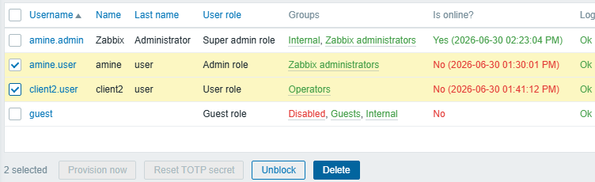
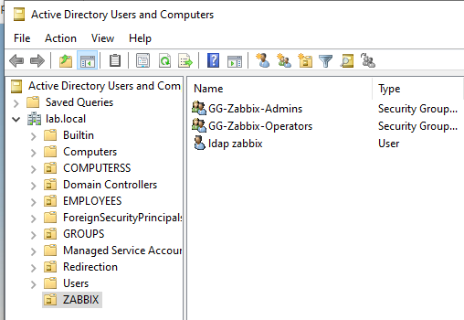
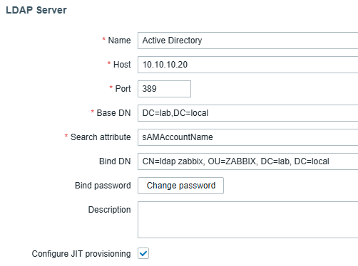
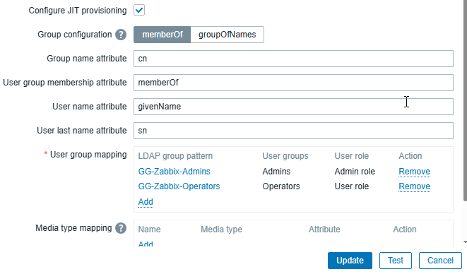
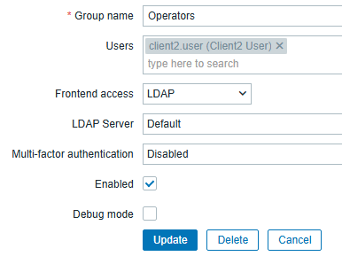

# Active Directory Authentication
### Objective
The objective of this section was to integrate Zabbix with the existing Active Directory infrastructure in order to centralize user authentication and simplify account management.  
The accounts amine.user and client2.user created previously were removed from the local Zabbix user database before configuring LDAP authentication to avoid conflicts between local and Active Directory accounts.  

## Creating Active Directory Security Groups
A dedicated Organizational Unit (OU=ZABBIX) was created in Active Directory to store objects related to the Zabbix platform.
#### Two Global Security Groups were then created:
    • GG-Zabbix-Admins
    • GG-Zabbix-Operators
#### The existing Active Directory users were assigned to the appropriate groups:
    Active Directory Group	    Members
    GG-Zabbix-Admins	        amine.user
    GG-Zabbix-Operators	        client2.user
A dedicated LDAP service account named ldap.zabbix was also created inside the ZABBIX organizational unit.   
This account is used exclusively by Zabbix to query the Active Directory and follows the principle of least privilege.  

## Configuring LDAP Authentication
A new LDAP authentication server was configured in Zabbix using the existing Active Directory domain.
#### Configuration:
    Setting	            Value
    Name	            Active Directory
    Host	            10.10.10.20
    Port	            389
    Base                DN	DC=lab,DC=local
    Search attribute	sAMAccountName
    Bind DN	CN=ldap     zabbix,OU=ZABBIX,DC=lab,DC=local
    Authentication	    LDAP

The LDAP connection was verified using the built-in Test function before enabling authentication.
## Configuring Just-In-Time (JIT) Provisioning
Just-In-Time (JIT) provisioning was enabled to automatically create Zabbix users during their first successful LDAP authentication.
#### The following settings were configured:
    Setting	Value
    Group configuration	memberOf
    Group name attribute	cn
    User group membership attribute	memberOf
    Deprovisioned users group	Disabled
#### LDAP group mappings:
    Active Directory Group	Zabbix User Group	Assigned Role
    GG-Zabbix-Admins	    Admins	            Admin
    GG-Zabbix-Operators	    Operators	        User

This configuration automatically assigns users to the correct Zabbix groups and roles based on their Active Directory group membership.
## Configuring Frontend Access
To allow users to authenticate through Active Directory, the Frontend access method of the LDAP user groups was changed from System default to LDAP.  
#### Configuration:
    Zabbix User Group	    Frontend Access
    Admins	                LDAP
    Operators	            LDAP

The default Zabbix administrators user group was left unchanged and continued to use the System default authentication method for the local Super admin account.

## Authentication Validation
The LDAP integration was validated by authenticating with Active Directory accounts.  
Successful authentication automatically created the corresponding users in Zabbix through JIT provisioning and assigned the appropriate user groups and roles according to the configured mappings.  
The local amine.admin account remained available as a permanent Super admin account for emergency access if the LDAP service becomes unavailable.

