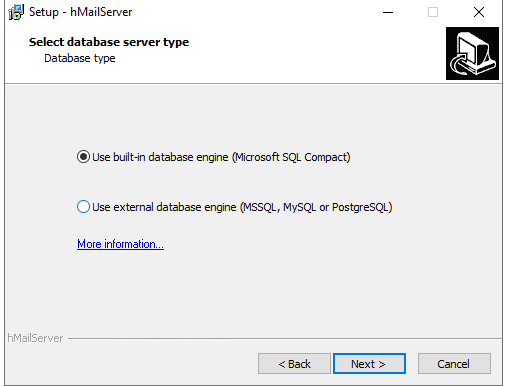
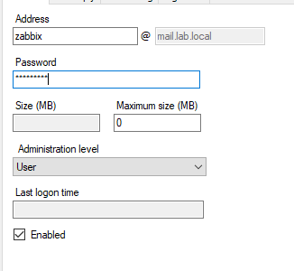
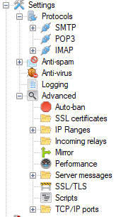
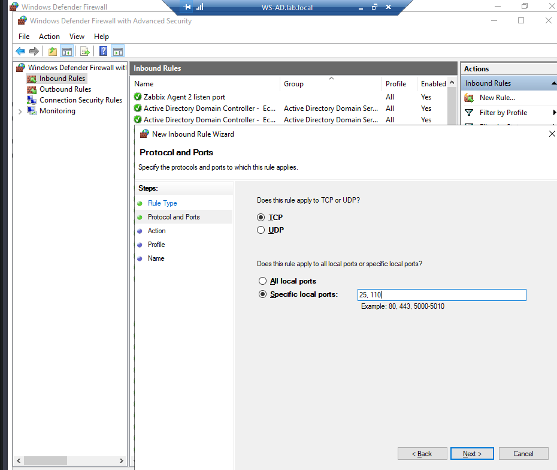
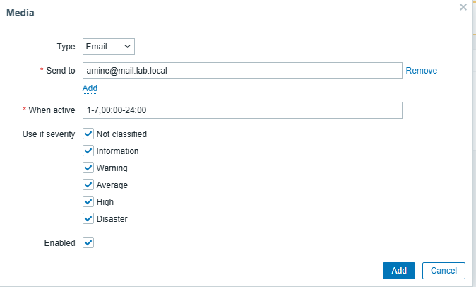
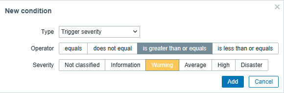
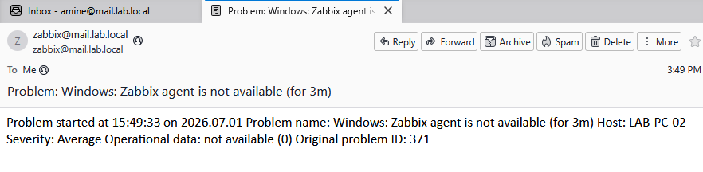

# Email Notifications
## Installing and Configuring hMailServer
A local mail server was deployed using hMailServer to provide SMTP services for Zabbix notifications within the lab environment.  
During the installation, the built-in database engine (Microsoft SQL Compact) was selected to simplify the deployment.  

## Creating the Mail Domain
A new mail domain named mail.lab.local was created.  
This domain is used to host the mailboxes required for the monitoring infrastructure.

## Creating Mail Accounts
#### Three mail accounts were created:
    Email Address	        Purpose
    zabbix@mail.lab.local	SMTP sender account used by Zabbix
    amine@mail.lab.local	Primary recipient for monitoring alerts
    client2@mail.lab.local	Secondary mailbox used for testing

## Basic SMTP Configuration
The SMTP configuration was completed by defining the local host name under the SMTP settings.  
To simplify testing in the lab environment, the Auto-ban feature was disabled to prevent temporary IP address blocks during repeated authentication attempts.

## Configuring Windows Firewall
Windows Defender Firewall was configured to allow incoming mail traffic to the hMailServer service.
#### A new Inbound Rule was created with the following configuration:
    Setting	            Value
    Rule Type	        Port
    Protocol	        TCP
    Local Ports	        25, 110
    Action	            Allow the connection
    Profile	            Domain, Private, Public
    Name	            hMailServer SMTP/POP3

This rule allows SMTP (TCP/25) and POP3 (TCP/110) connections to reach the mail server.
## Configuring User Media
An email media was added to the amine.user account.
#### Configuration:
    Setting	            Value
    Media type	        Email
    Send to	            amine@mail.lab.local
    Active period	    1-7, 00:00-24:00
    Severity	        All
    Enabled	            Yes

This configuration allows Zabbix to associate email notifications with the corresponding user.
## Creating an Email Notification Action
A new Trigger Action was created to automatically send email notifications when a monitored problem is detected.
#### Configuration:
    Setting	            Value
    Name	            Email notification - Host problems
    Event source	    Triggers
    Conditions	        Trigger severity: Warning, Average, High, Disaster
    Operation	        Send message
    Recipient	        amine.user
    Media type	        Email
    Message	            Default message

After creating the action, an email media was assigned to amine.user, allowing Zabbix to associate the user with the email address amine@mail.lab.local.  
Whenever a trigger matching the configured conditions is generated, Zabbix automatically executes the action and sends an email notification to the configured recipient through the local SMTP server.

## Notification Validation
The notification system was validated by intentionally generating a monitoring event on LAB-PC-02.
### When the problem was detected, Zabbix:
    1. Generated a trigger.
    2. Executed the configured action.
    3. Connected to hMailServer using SMTP.
    4. Sent an email notification to amine@mail.lab.local.

The email was successfully received in Mozilla Thunderbird, confirming that the complete notification workflow operated correctly.