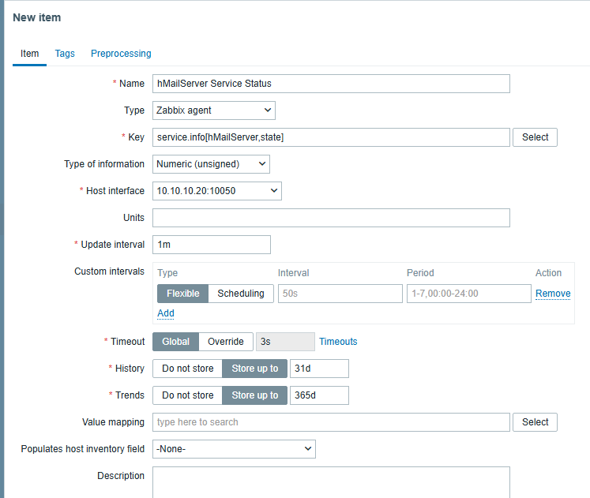
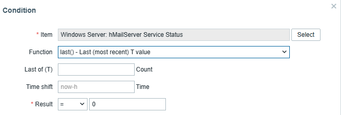
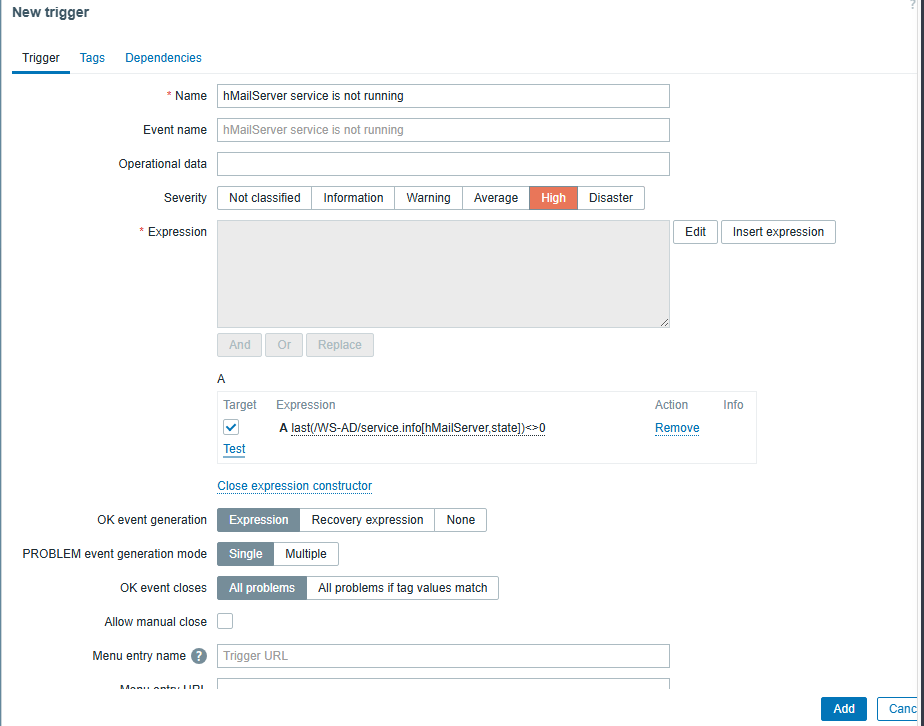
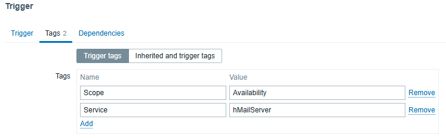
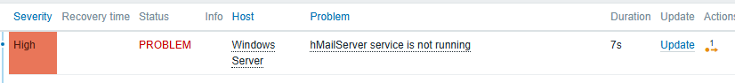
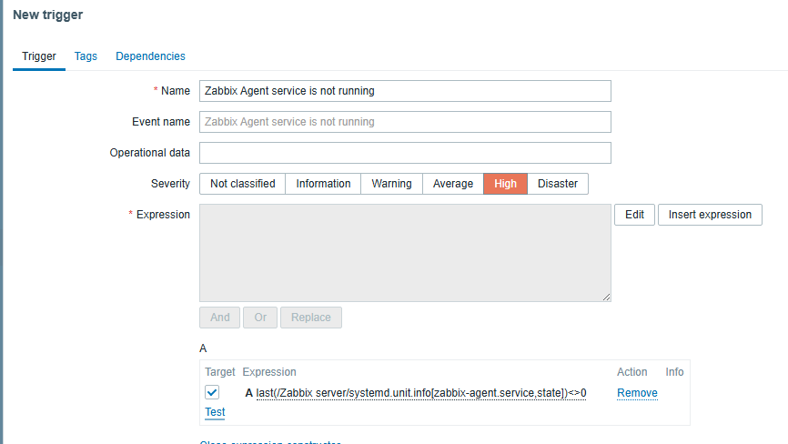

# Service Monitoring
### Objective
The objective of this section was to monitor critical services running on Windows and Linux servers. Unlike host availability monitoring, service monitoring makes it possible to detect failures affecting individual applications while the operating system remains online.
## Windows Service Monitoring
A custom monitoring item was created to monitor the hMailServer service on WS-AD.
### Creating the Item
#### Navigation:
    Data collection
    → Hosts
    → WS-AD
    → Items
    → Create item
#### Configuration:
    Setting	                Value
    Name	                hMailServer Service Status
    Type	                Zabbix agent
    Key	                    service.info[hMailServer,state]
    Type of information	    Numeric (unsigned)
    Update interval	        1m

The item queries the Windows service state through the Zabbix Agent.

#### A successful test returned the value: 
    0
which indicates that the service is running.
### Creating the Trigger
A custom trigger was created to generate a problem whenever the service stops.
#### Navigation:
    Data collection
    → Hosts
    → WS-AD
    → Triggers
    → Create trigger
#### Configuration:
    Setting	Value
    Name	hMailServer service is not running
    Severity	High
    Expression	last(/WS-AD/service.info[hMailServer,state])<>0

The trigger evaluates the latest value collected by the monitoring item.  
Whenever the service state becomes different from 0, Zabbix automatically generates a problem event.
### Tag Configuration
To simplify event classification and filtering, the trigger was configured with the following tags:
    Tag	                    Value
    Service	                hMailServer
    Scope	                Availability

The monitoring configuration was validated by stopping the hMailServer service.   

Zabbix successfully detected the service interruption and generated the corresponding problem.
### Monitoring Additional Windows Services
The same methodology was applied to monitor the remaining critical Windows services.  
#### Each service was configured with a dedicated monitoring item and trigger using the appropriate Windows service name.  
    Service	                            Tags
    DNS	                                Service=DNS, Scope=Availability
    Active Directory Domain Services	Service=ADDS, Scope=Availability
    DHCP                                Server	Service=DHCP, Scope=Availability
    Windows Time	                    Service=W32Time, Scope=Availability
    hMailServer	                        Service=hMailServer, Scope=Availability
    Zabbix Agent 2	                    Service=Zabbix Agent 2, Scope=Availability

## Linux Service Monitoring
The same monitoring methodology was applied to the Ubuntu server.  
Unlike Windows, Linux services are managed by systemd. The Zabbix Agent queries the service state using systemd-related monitoring keys.  
For example, the Zabbix Agent service was monitored by creating a custom monitoring item and trigger.  
#### Navigation:
    Data collection
    → Hosts
    → Ubuntu Server
    → Items
    → Create item
#### Configuration:
    Setting	                Value
    Name	                Zabbix Agent Service Status
    Type	                Zabbix agent
    Key	                    systemd.unit.info[zabbix-agent.service,state]
    Type of information	    Numeric (unsigned)
    Update interval         1m

A custom trigger was then created to detect whenever the service stops.
#### Configuration:
    Setting	                Value
    Name	                Zabbix Agent service is not running
    Severity	            High
    Expression	            last(/Ubuntu Server/systemd.unit.info[zabbix-agent.service,state])<>0
#### The trigger was tagged as follows:
    Tag	                    Value
    Service	                Zabbix Agent
    Scope	                Availability
