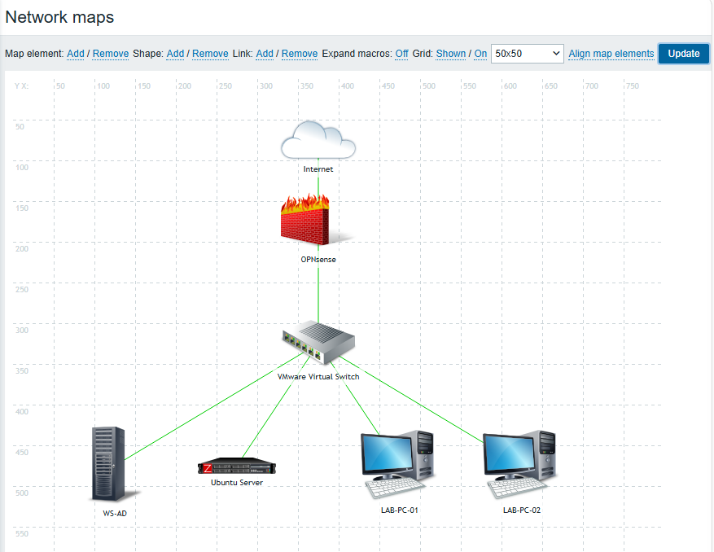

# Network Map
To provide a visual representation of the laboratory infrastructure, a network map was created in Zabbix.  
#### Navigation:
    Monitoring
    → Maps
    → Create map
#### The map was named:
    Lab Infrastructure
After creating the map, graphical elements representing the laboratory components were added and arranged to reflect the actual network topology.
#### The following elements were included:
    Element	                    Description
    Internet	                External network
    OPNsense	                Firewall and default gateway
    VMware Virtual Switch	    Virtual Layer 2 network connecting all virtual machines
    WS-AD	                    Windows Server (Active Directory, DNS, DHCP, hMailServer)
    Ubuntu	                    Zabbix Server
    LAB-PC-01	                Windows 10 client
    LAB-PC-02	                Windows 10 client
Each element was connected using Zabbix links to represent the communication paths between the devices.
The final topology reflects the laboratory architecture:
