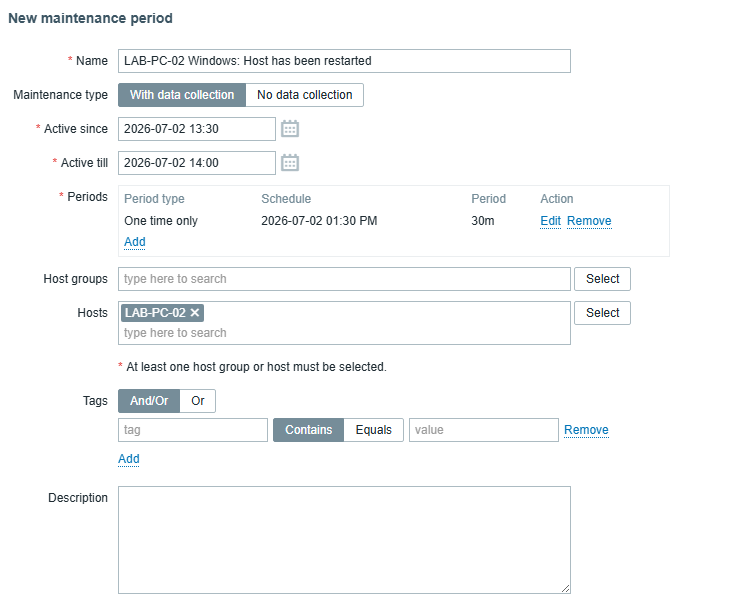
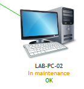
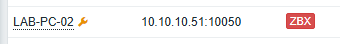

# Maintenance
Zabbix maintenance periods are used to suppress alerts during planned administrative operations, such as software updates or scheduled server shutdowns.
#### Navigation:
    Data collection
    → Maintenance
    → Create maintenance
#### The following configuration was used:
    Parameter	            Value
    Name	                LAB-PC-02 Maintenance
    Maintenance type	    With data collection
    Host	                LAB-PC-02
    Time period	            One time only (30 minutes)

The With data collection option was selected to continue collecting monitoring data while disabling problem generation and notifications.

### Verification
To verify the configuration, LAB-PC-02 was intentionally powered off during the maintenance period.   
The host was marked with the maintenance icon, and no problem events or email notifications were generated, confirming that the maintenance period successfully suppressed alerts during the scheduled operation.  

