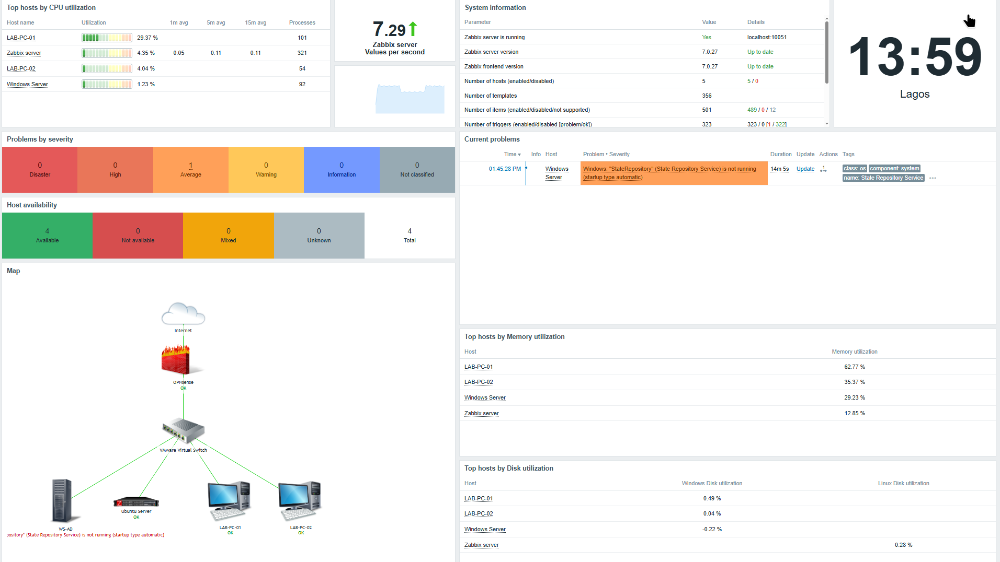

# Dashboard
A custom dashboard was created to provide a centralized view of the laboratory infrastructure and its overall health.
#### The dashboard was customized to display the most relevant monitoring information, including:
    • Current problems
    • Problem severity summary
    • Host availability
    • Top CPU utilization
    • Top memory utilization
    • Top disk utilization
    • Network topology map
    • Local time
    • Zabbix system information
    • Zabbix performance (number of processed values per second)
    • Zabbix performance graph (number of processed values per second)
This dashboard enables administrators to quickly assess the status of the monitored environment, identify active issues, monitor resource utilization, visualize the network topology, and monitor the performance of the Zabbix server from a single interface.
