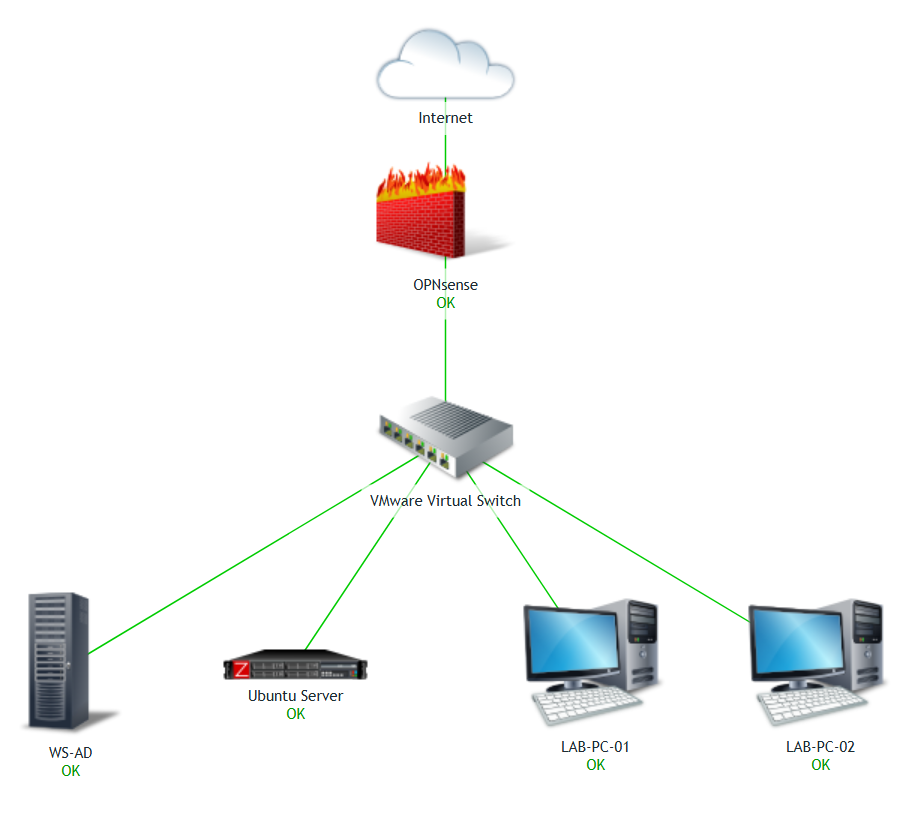

# Virtual-Homelab
### Enterprise virtual homelab featuring Windows Server, Active Directory, Ubuntu Server, OPNsense, Zabbix, and PowerShell automation.

---

## 📖 Project Overview

This homelab was designed to simulate a real-world enterprise network.

The project covers:

- Windows Server deployment
- Active Directory Domain Services (AD DS)
- Organizational Units (OUs)
- User and Group Management
- Group Policy Objects (GPOs)
- File Server (SMB)
- DHCP & DNS
- OPNsense Firewall
- Ubuntu Server
- Remote Administration
- Zabbix Monitoring
- PowerShell Automation

---

## 🏗️ Infrastructure

---

## 🖥️ Lab Environment

| Component | Technology |
|-----------|------------|
| Hypervisor | VMware Workstation |
| Domain Controller | Windows Server 2022 |
| Client OS | Windows 10 |
| Linux Server | Ubuntu Server 24.04 LTS |
| Firewall | OPNsense |
| Monitoring | Zabbix 7 |
| Database | PostgreSQL |
| Scripting | PowerShell |

---

## ✨ Features

- ✅ Active Directory Domain Services
- ✅ Organizational Units
- ✅ Domain Users & Groups
- ✅ Group Policy Management
- ✅ File Server
- ✅ Shared Folders
- ✅ DHCP Server
- ✅ DNS Forward & Reverse Lookup Zones
- ✅ OPNsense Firewall Configuration
- ✅ Ubuntu Server Administration
- ✅ SSH & Remote Desktop
- ✅ Zabbix Monitoring
- ✅ LDAP Authentication
- ✅ Email Notifications
- ✅ PowerShell Automation

---

## 📸 Screenshots

### Active Directory Users and Computers

### Group Policy Management

### OPNsense Dashboard

### Zabbix Dashboard

---

## 📜 PowerShell Scripts

Automation scripts are available in:

- [Scripts](./scripts/)

---

## 🎯 Skills Demonstrated

- Windows Server Administration
- Linux Administration
- Active Directory
- DNS
- DHCP
- Group Policy
- SMB
- Remote Administration
- Infrastructure Monitoring
- Firewall Configuration
- PowerShell
- Bash
- Troubleshooting
- Documentation

---
